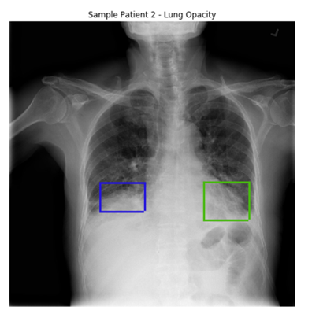
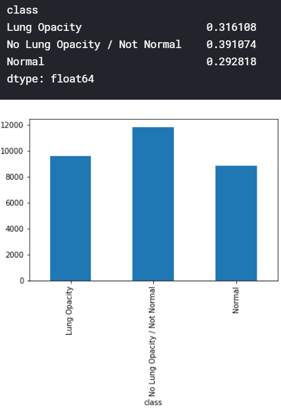
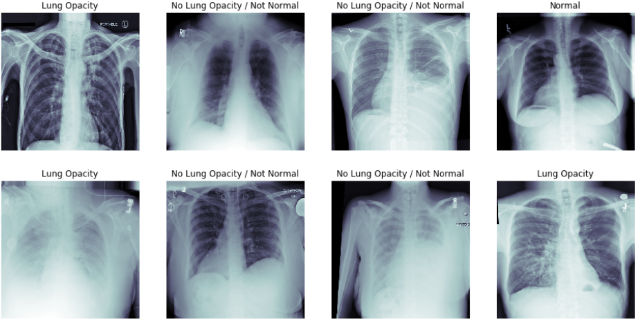
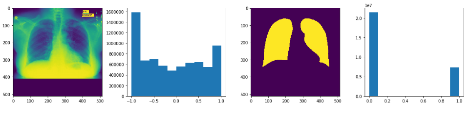
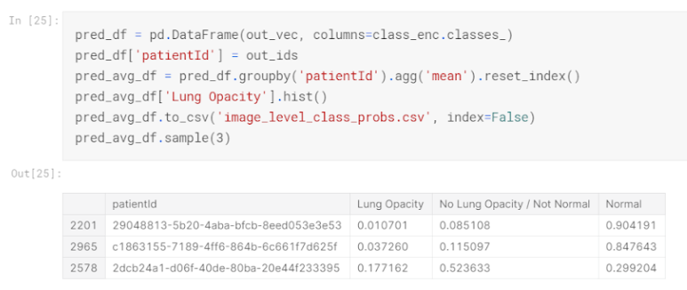
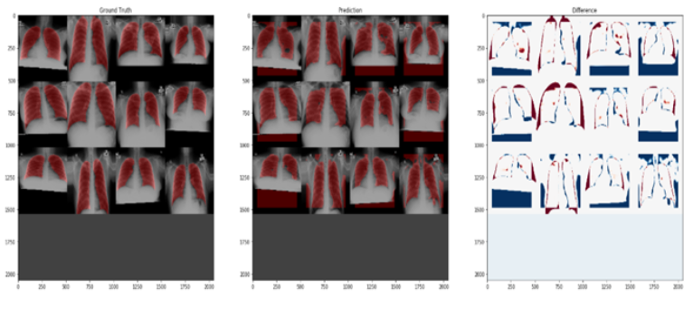
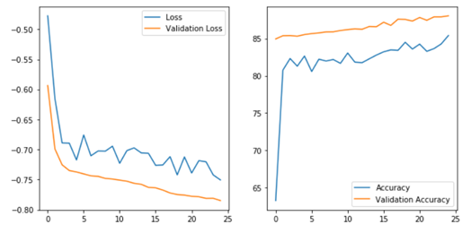
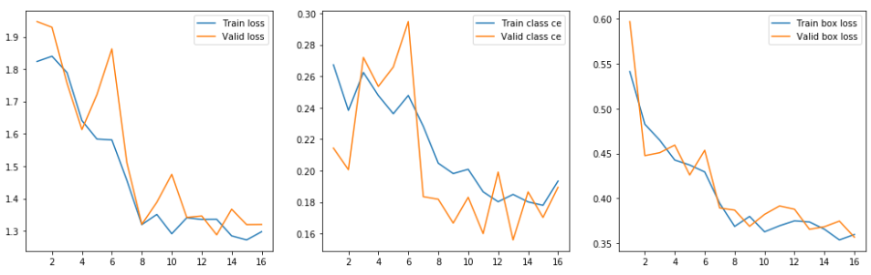
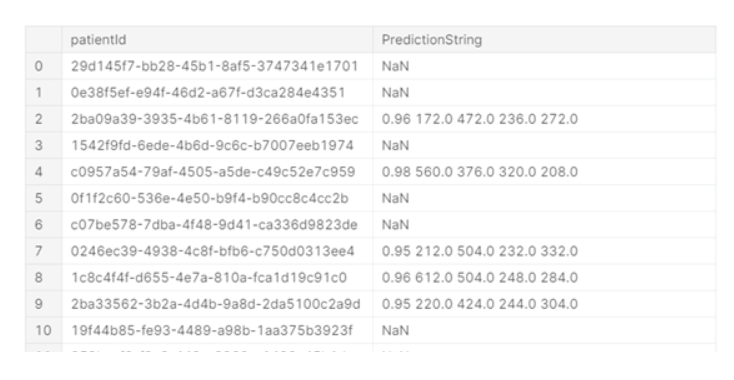
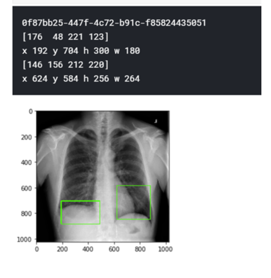

# Pneumonia Detection from Chest Radiographs (CXR) using Deep Learning

## Abstract

Acute respiratory infections accounted for nearly **70% of all communicable diseases in India in 2018**, with **pneumonia being the deadliest**, causing approximately **1.27 lakh deaths in 2019**.

To address this healthcare challenge, we developed and compared three deep learning models:
- **CNN-based VGG16 classifier**
- **U-Net segmentation model**
- **Mask R-CNN localization model**

These models aim to automatically detect and localize pneumonia in **Chest X-Ray (CXR)** images to improve diagnosis and response time.

---

## Objectives

1. Identify whether a patient's Chest X-Ray (CXR) shows signs of pneumonia.
2. Automatically **locate lung opacities** on CXR images using deep learning algorithms.
3. Localize infection regions to **assist radiologists** in faster and more accurate diagnosis.

---

## What are lung opacities?

Opacity refers to any area that preferentially attenuates
the x-ray beam and therefore appears more opaque than the
surrounding area. Any area in the chest radiograph that is more
white than it should be. In sample patient image below,
you can see that the lower boundary of the lungs of patient
is obscured by opacities. Since the lungs are filled with other
material - fluids, bacteria, immune system cells, etc. That’s
why areas of opacities are areas that are grey.

  

## Statistical Analysis of the Dataset

The dataset used in this project includes **Chest X-Ray (CXR)** images with associated labels and bounding box annotations. Below is a summary of the dataset characteristics:

### Class Distribution

The dataset consists of **three major classes**:

- **Normal**: 29%
- **No Lung Opacity / Not Normal**: 40%
- **Lung Opacity**: 31%

> These classes represent varying radiological observations relevant for pneumonia classification.

---

### Dataset Overview

- **Total Bounding Boxes**: 30,227  
- **Unique Patient IDs**: 26,684

---

### Pneumonia Label Distribution

- **Target = 0 (No Pneumonia)**: 68.4%  
- **Target = 1 (Pneumonia Positive)**: 31.4%

This class imbalance suggests the need for **balanced sampling**, **data augmentation**, or **class-weighting strategies** during model training.

---

  

## Models & Implementation

### General Pipeline
1. **Image Downscaling** from original resolution (1024x1024x3) as per model requirements.
2. **Data Split** into training, validation, and test sets.
3. Optional **Data Augmentation** for generalization.
4. Set **batch size**, **epochs**, and **model hyperparameters**.
5. **Model Training**:
   - Forward propagation
   - Backward propagation using loss minimization
6. Monitor metrics and **perform predictions** on unseen data.

---

## Model Architectures

### CNN Classifier (VGG16)

- **Purpose**: Binary classification (Pneumonia vs. Normal)
- **Architecture**: Transfer learning with pretrained **VGG16**
- **Layers**: 16 convolutional layers from ImageNet; fine-tuned top layers for pneumonia detection.
- **Loss Function**: `categorical_crossentropy`
- **Optimizer**: `Adam`

---

  

### U-Net for Lung Segmentation

- **Purpose**: Biomedical image segmentation to extract **lung masks**.
- **Architecture**: Classic U-Net with **encoder-decoder** structure.
- **Output**: Binary masks highlighting lung areas and opacities.
- **Loss Function**: `binary_crossentropy` + `dice_coefficient`
- **Optimizer**: `Adam`

---

  

### Mask R-CNN for Infection Localization

- **Purpose**: Localize **regions of pneumonia** in CXRs.
- **Architecture**: Two-stage:
  1. Region proposal
  2. Classification + bounding box regression
- **Output**: Bounding boxes and masks around infected areas.
- **Performance**: High precision in predicting X, Y coordinates and width-height of infected zones.

---

## Results

### VGG16 Classification Model
- Outputs class probabilities.
- Assigns label based on **highest softmax probability**.
- Fast and lightweight but lacks localization capability.

  

### U-Net Segmentation Model
- Overlays predicted lung masks on original CXR images.
- Useful for **visual comparison** and understanding infection areas.
- Susceptible to noise, which affects prediction consistency.

  

  

### Mask R-CNN Localization Model
- **Most comprehensive and accurate** among all models.
- Accurately predicts **bounding boxes** and **infection coordinates**.
- Enables precise identification of pneumonia-affected regions on CXRs.

---

  

  

  

## Conclusion

Deep learning approaches like CNNs, U-Nets, and Mask R-CNNs are proving to be **powerful tools in medical diagnosis**.

In this project:
- **Mask R-CNN** performed best for pneumonia detection and localization.
- The models can significantly **reduce diagnosis time** and aid healthcare professionals.

### Future Work
- Improve robustness of segmentation using advanced denoising techniques.
- Train on **larger and diverse datasets** for better generalization.
- Optimize inference time for **real-time medical diagnostics**.

---

